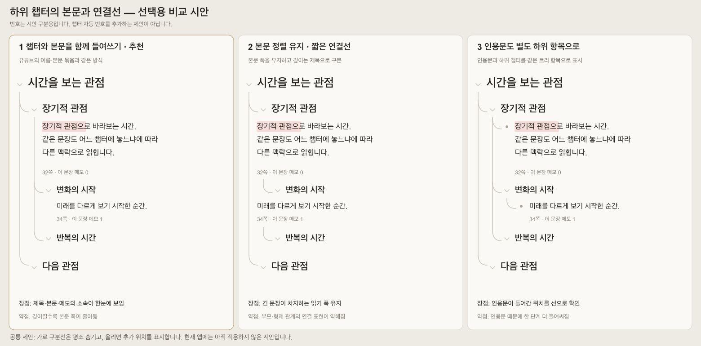

# 하위 챕터 표시 비교와 여백 이동

## 현재 결과

사용자가 1번을 선택하여 앱에 적용했다. 챕터 제목·인용문·페이지·메모가 같은 소속 묶음으로 들여써진다. 아래 그림은 선택 당시 비교 자료이며 2·3번은 적용하지 않았다.

1. **제목·본문 함께 들여쓰기 — 추천.** 챕터 제목과 인용문·메모를 한 묶음으로 표시한다. 소속이 명확하고 선을 글자 앞에서 끊을 필요가 줄지만, 깊은 항목의 본문 폭이 줄어든다.
2. **본문 정렬 유지·짧은 연결선.** 기존의 모든 인용문 시작선을 유지한다. 깊은 제목은 짧은 곡선으로 표시하므로 읽기 폭을 확보하지만 부모·형제의 연속 연결이 약해진다.
3. **인용문도 하위 항목으로 표시.** 인용문과 하위 챕터를 트리의 항목처럼 표시한다. 소속을 선으로 확인할 수 있지만 한 단계 더 들여써진다. 저장 구조 변경 제안은 아니다.

공통 시각 가설은 평소 가로 경계를 감추고 호버 시 추가 위치를 드러내는 것이다. 선택한 1번의 경계 표시와 묶음 들여쓰기를 현재 앱에 적용했다. 번호는 시안 번호이며 자동 챕터 번호가 아니다.

## 실제 참고와 진단

- 2026-09-13 [YouTube 실제 댓글](https://www.youtube.com/watch?v=jNQXAC9IVRw)을 열어 하위 답글과 형제 답글을 직접 확인했다. 같은 화면을 사용자가 13:08 캡처로 제공했다.
- 관찰: 댓글의 이름·본문·조작이 같은 묶음으로 들여써진다. 곡선과 세로선은 그 묶음 왼쪽에 있고, 같은 부모의 형제는 같은 열에 놓인다. 이 관찰을 모든 기기·계정의 YouTube UI로 일반화하지 않는다.
- 현재 앱은 챕터 제목만 들여쓰고 인용문은 공통 시작선으로 돌아오기 때문에, 선을 본문 앞에서 끊어야 하는 구조다. 사용자의 1번 선택으로 이 기존 시각 규칙을 변경했다.

## 여백 이동 검증

- Node24.13.0: `npm test` 70개 파일/499개 통과. 타입 검사와 빌드 통과.
- 개발·빌드 모의 API에서 실제 여백 드래그, 취소, 저장 실패·재시도, 새로고침, 글자 선택·강조, 체크박스, 키보드 및 좁은 화면을 확인했다.
- 빌드는 night/18pt 프로필을 사용했다. 기존 본문·조작의 분리와 연결선 겹침 없음도 검사했다.
- 첫 글자 가장자리 선택 실패의 원인은 글자 영역의 active 축소 효과였다. 누르기 전후 SPAN→빈 DIV로 대상이 바뀌는 것을 확인하고 해당 효과를 제거했다. 첫 선택 제스처에서 강조 저장 요청이 나가는 것을 재검증했다.
- 실제 사용자 인용문 위치·운영 DB·배포는 변경하지 않았다. 실기기 터치 검증은 별도다.

## 결정 구분

- 사용자 결정: 여백 이동 추가, 유튜브 댓글을 다시 참고한 하위 표시 개선.
- Codex 결정: 글자·조작 영역 보호, 위치 판별 불가 시 글자 선택 우선, 읽는 글자의 누름 축소 제거. 1안 추천은 제안이다.
- 기존 동작 유지: 손잡이·키보드 이동, 선택·강조, 저장 API와 계층 규칙.
- 미검증 사항: 운영 환경·실기기 터치. 1번의 로컬 앱 적용은 완료했다.
- 남은 사용자 결정: 실제 배포 여부. 디자인 선택은 완료했다.

## 1번 적용 확인

- `scripts/qa-thread-grouping.js`: 개발 및 빌드 night/18pt에서 소속 제목과 인용문 시작선 일치, 기본 연결선 연속, 본문 영역과의 경로 교차 없음, 드롭 표시 위치 일치를 확인했다.
- 긴 공백 없는 글자도 들여쓴 본문 폭 안에서 줄바꿈된다. 375px에서 여백 드래그·키보드 이동·마지막 인용문 조작의 고정 입력창 위 스크롤을 확인했다.
- 기존 `scripts/qa-chapter-editing.js`도 빌드에서 통과했다. 기존 전역 인용문 정렬 검사는 새로 승인한 소속 챕터 기준 정렬로 변경했다.
- 코드 독립 검토에 확실한 신규 회귀 지적 없음. 저장 API·운영 DB·사용자 인용문 위치·배포는 변경하지 않았다.
- [적용 화면 — 모의 데이터](../../output/playwright/thread-group-1440.png)
- [어두운 테마·긴 본문 검사](../../output/playwright/thread-group-dark-large-1440.png)
